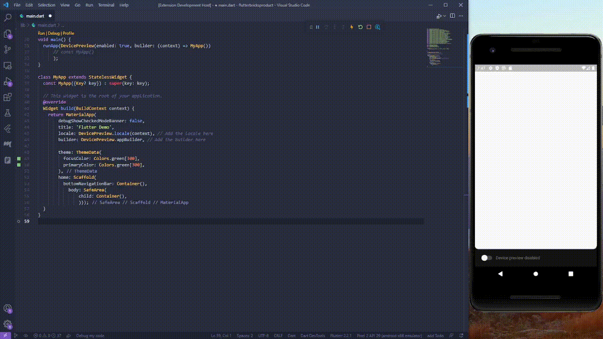
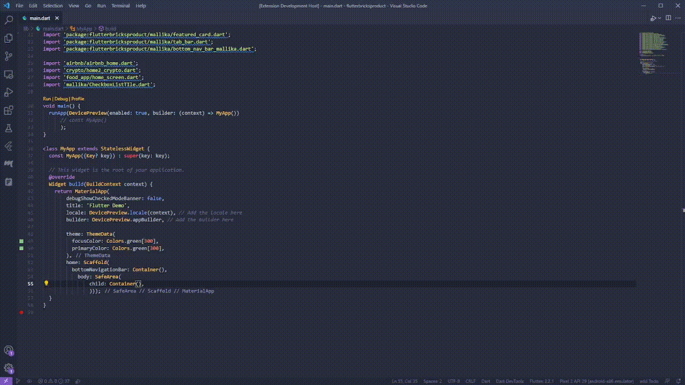

# Profile

My New flutter Project For launching My Profile in Various Social Media Platforms

    * My Profile in Github
    * My Profile in Linkedin
    * My Profile in Instagram
    * My Profile in Twitter
    * My Profile in Youtube

This is the Working Demo of My App

But I'm not done this whole app all by Myself.
I used an Extension named Flutter Bricks by Flutter Bricks Teams .This Extension provides you with a bunch of useful widgets that you can use to build your Flutter apps just with some renaming you able to create your own widgets and use them in your Flutter apps.

# Source
Flutter Bricks Team making a Flutter Plugin for VSCode and in Web version too for premade widgets like 

        *AppBar
        *BottomNavigationBar
        *Backgrounds
        *Buttons
        *Cards
        *Dialogs
        *Gradients
        *Icons(3D)
        *Icon Buttons
        *Illustrations
        *Inputs
        *List Views
        *Profile
        *Progress(Loading and Progress)
        *Sliders
        *Popups
        *Snackbars
        *Tabs
        *Social Media Buttons
    
And Also premade screens for 

        *Onboarding 
        *Login
        *Signup
        *Home
        *Profile, etc.

It's in Alpha stage and They're working on it.

Give your feedback on this Product and if you have any queries or feedback, 
please contact them it'll  be more useful for them to make even better product and services.

For more Information visit [Flutter Bricks](https://www.flutterbricks.com/)

# Usage

Just add the Extension to your VSCode and you're good to go. 
For easy access to the extension, you can use the following command:

flutterbricksproductions.flutterbricks 

**Name:** FlutterBricks

**Id:** flutterbricksproductions.flutterbricks

**Description:** FlutterBricks provides hundreds of beautiful flutter UIs at your fingertips. Browse responsive and accessible Flutter components, screens, illustrations, and icons and copy them directly into your project - without even leaving your code editor! No boilerplate necessary! 

**Version:** 0.0.2

**Publisher:** FlutterBricksProductions

**VS Marketplace Link:** 
https://marketplace.visualstudio.com/items?itemName=FlutterBricksProductions.flutterbricks

See the below gifs for how to use the extension.

